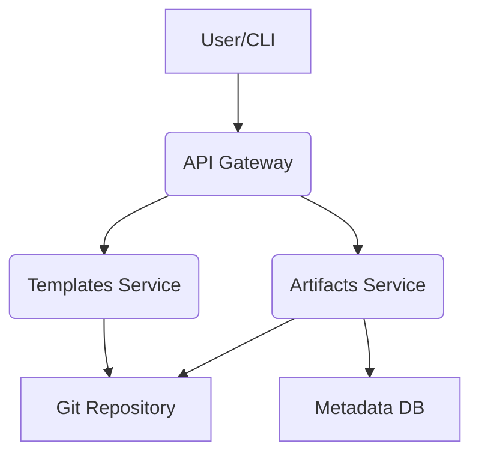

# Blueprint: AaaS MVP Overview

## 1. Introdução
Este documento apresenta a arquitetura de alto nível para o Minimum Viable Product (MVP) do Architecture as a Service (AaaS). O AaaS visa centralizar e automatizar a criação, gestão e governança de artefatos arquiteturais, promovendo consistência e agilidade dentro da organização.

## 2. Escopo do MVP
O MVP do AaaS focar-se-á nos seguintes pilares:
*   **Gestão de Artefatos**: Armazenamento e versionamento de blueprints, ADRs e diagramas.
*   **Catálogo de Modelos**: Provisão de templates para artefatos arquiteturais comuns.
*   **Interface Básica**: Uma UI/API para interação com os serviços de gestão.

## 3. Componentes Chave
### 3.1. Core Service
*   **API Gateway**: Ponto de entrada unificado para todas as interações.
*   **Artifacts Service**: Responsável pela CRUD de artefatos, versionamento e metadados.
*   **Templates Service**: Gerencia o catálogo de modelos e a criação de artefatos a partir deles.

### 3.2. Armazenamento
*   **Git Repository**: Usado para persistir o conteúdo dos artefatos (Markdown, JSON, XML), aproveitando o versionamento nativo.
*   **Database (NoSQL/RDBMS)**: Para metadados dos artefatos (ID, tipo, status, histórico, tags).

### 3.3. Interface
*   **Web UI (SPA)**: Interface de usuário para consumo e criação de artefatos.
*   **CLI (Opcional no MVP)**: Ferramenta de linha de comando para automação.

## 4. Tecnologias Propostas (Exemplos)
*   **Backend**: Python (FastAPI/Django) ou Node.js (Express).
*   **Frontend**: React, Vue ou Angular.
*   **Database**: PostgreSQL, MongoDB, DynamoDB.
*   **Versionamento**: Git (GitHub, GitLab, Bitbucket).
*   **Infraestrutura**: Docker, Kubernetes (para escalabilidade futura), Cloud Provider (AWS, Azure, GCP).

## 5. Arquitetura de Alto Nível

## 6. Próximos Passos
*   Definição detalhada dos endpoints da API.
*   Design de schema para metadados de artefatos.
*   Prototipagem da UI.